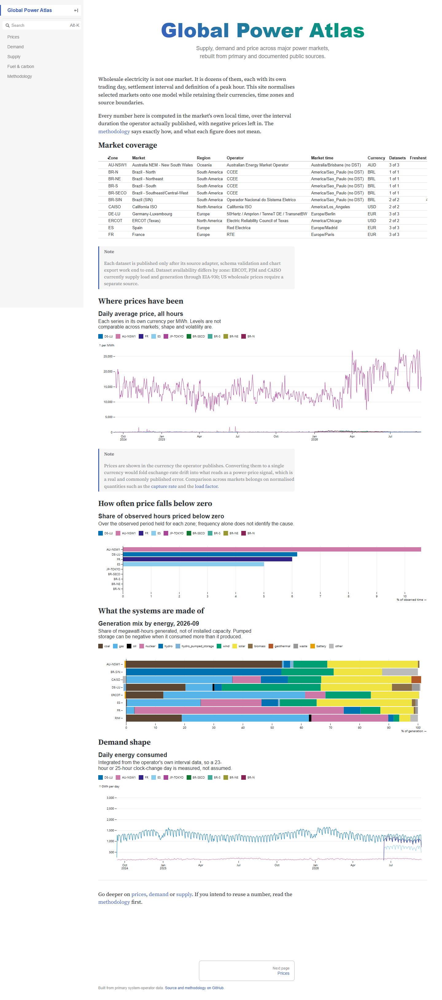

# German Power Market Research — DE-LU day-ahead and storage

**Solar killed Germany's peak premium. The spread a battery earns doubled.**
A reproducible study of the German-Luxembourg power market that establishes that
claim from primary system-operator data, then tests it the only way that settles
it — by dispatching a battery against realised prices and measuring what the
shape is actually worth.

[](https://github.com/Pedrods20/global-power-atlas/actions/workflows/ci.yml)
[](https://github.com/Pedrods20/global-power-atlas/actions/workflows/deploy.yml)

**[Open the live site](https://pedrods20.github.io/global-power-atlas/)** ·
[Market view](site/index.md) · [Forecast evidence](site/forecast.md) ·
[Storage value](site/battery.md) · [Methodology](site/methodology.md)



## The finding

Germany's day-ahead price no longer pays a premium for the hours the market used
to call peak. It pays for the hours solar cannot reach. Those are different
statements about the same market, and they are routinely confused because they
show up in different statistics.

| DE-LU | 2019 | 2022 (gas crisis) | 2026 YTD |
|---|---|---|---|
| On-peak minus off-peak block | +10.6 EUR/MWh | +49.6 | **−13.7** |
| Within-day high minus low, % of that year's baseload | 80% | 79% | **169%** |
| Solar capture rate | 0.93 | 0.94 | **0.51** |
| Wind capture rate | 0.87 | 0.74 | 0.90 |
| Hours below zero | 2.4% | 0.8% | **7.2%** |
| Installed solar | 46 GW | 63 | **118** |
| Battery fleet | — | 4.2 GW | **21.1 GW / 32.9 GWh** |
| Battery fleet average duration | — | 1.51 h | 1.56 h |
| Pumped hydro (the incumbent) | 9.3 GW (2011) | 10.0 GW | 9.9 GW |
| Arbitrage value, 1 MW / 4 MWh, perfect foresight | — | 487 EUR/MW/day | **451** |

Three things follow, and each is on the site with its evidence.

1. **The block spread and the within-day range moved in opposite directions.** A
   fixed block contract is paid the first; a battery is paid the second. Reading
   only the block spread says storage arbitrage is dying exactly when it is not.
2. **2022 was a price-level shock; what followed is a change in shape.** In
   euros 2022 is still the best year for the battery (487 against 451 EUR/MW/day),
   and that is not a contradiction: 2026 delivers **95% of 2022's absolute daily
   range on a baseload price 55% lower**. A spread that came from a fuel shock
   left with the gas price; a spread that comes from 118 GW of solar is one a
   lender can underwrite. Solar did this, not wind — wind's capture rate barely
   moved, because it blows across the day and the seasons while solar arrives in
   the same six hours in every plant at once.
3. **Storage competition has not compressed it yet**, and two things explain
   why. Germany's ~9.9 GW of pumped hydro — the incumbent that actually arbitrages
   this spread — has been flat since at least 2011, so the capable fleet did not
   grow. And the batteries that did arrive are the wrong shape: average duration
   held at 1.47–1.56 hours through a fivefold build-out, which is what a
   behind-the-meter home system is sized for, not a four-hour midday trough. The
   provider publishes no residential/grid-scale split, so that composition is
   inferred from the duration ratio; the tick from 1.47 to 1.56 hours in two
   years is the early signal against the argument.

## Does forecasting the shape pay? Partly — and that is the result

A per-hour ridge regression using only what a bidder holds at the **12:00 gate on
D-1** cuts day-ahead price error **24.3%** against the best naive alternative
(EUR 22.07/MWh against EUR 29.14/MWh, over 58,645 scored clock-hours, 2020-2026).

Converted into dispatch on a 1 MW / 4 MWh battery, that skill is worth about
**EUR 4,400/MW per year** — EUR 12/MW on an average day — more than repeating
the last similar day. Against that battery's whole gross margin of about **EUR
97,000/MW per year** before costs, the forecast contributes roughly **5%**. The
naive strategy earns the rest, because most of the value sits in the shape,
which repeats, rather than in the day-to-day deviation, which is what a forecast
adds. Ridge loses to that naive on **827 of 2,404 days**.

**The shape is the asset; the forecast is a margin on top of it.** That is the
honest commercial summary, and it points away from where most of the engineering
went — which is the sort of conclusion a portfolio is supposed to be willing to
publish.

So why build the forecast? Because that 5% is only trustworthy if the protocol
producing it is. The 12:00 gate, the vintage discipline and the walk-forward
boundaries are what stop a model from scoring itself on information no bidder
held, and they are what turn "our model beats the market" into a claim someone
can check. That discipline is the transferable part.

Two further results are worth the click:

- **A linear model wins where the money is.** LightGBM is competitive in ordinary
  hours and collapses in the tails: skill of −57% in the scarcest 5% of hours and
  −35% in negative-price hours, against Ridge's +16% and −4%. A model better on
  average and worse in the tails is the wrong model for a dispatch decision.
- **The best price forecaster is not the best dispatcher.** Similar-day is the
  second-worst of the five by MAE and the strongest naive comparator by margin.
- **A second daily cycle adds margin and shrinks the forecast's edge.** Allowing
  two charge-then-discharge episodes raises gross margin 16% but cuts Ridge's
  advantage over the naive by 15%, because the second episode is the midday
  solar trough — the most predictable feature of the German day.

## Reproducibility

The published release is a frozen, content-addressed backtest under
`data/experiments/`, committed alongside the site data it produced, not a live
recompute that would drift as the store grows. `gpa export --check` proves the
published site matches the Python analysis.

These are **retrospective development results** from an already-inspected
history — not an untouched holdout, not prospective trading returns. The base
case carries zero operating and degradation cost; both are explicit optimizer
inputs, and the site reports illustrative non-zero cases plus efficiency,
signal-attenuation, downtime and two-episode stresses separately. Day-ahead
arbitrage alone is a **lower bound** on a German battery's revenue: intraday and
balancing (FCR/aFRR/mFRR) markets are outside this study.

## Premises

| Premise | Value | Why |
|---|---|---|
| Forecast gate | 12:00 market time on D-1 | The day-ahead order book closes at midday for next-day delivery, so noon on D-1 is the last moment a real bidder holds information |
| Target | Duration-weighted local clock-hour mean of the day-ahead price | Since the market moved to 15-minute products this is an analytical hourly benchmark, not a per-quarter-hour trade forecast |
| Information set | Lagged prices, calendar features, residual load lagged at least two delivery days | Stored provider revisions cannot prove what was available at the historical gate, so realised delivery-day fundamentals are excluded |
| Evaluation | Expanding walk-forward, common sample, three naive baselines | A model that cannot beat "repeat a known price" has not earned its complexity |
| Model selection | Hyperparameters frozen on a validation window before the test period | Selection inside the evaluation window would report a tuned result as an out-of-sample one |
| Battery | 1 MW; 1/2/4 MWh; 90% round-trip; one episode/day in the headline; zero initial and terminal SOC | A deliberately simple, auditable asset, not a specific commercial project; a two-episode case is run and reported separately |
| Costs | Zero in the base case; illustrative 2/3 and 5/10 EUR per grid MWh reruns | Cost rates are not calibrated German project estimates, so they are shown as stresses rather than folded into the headline |
| Settlement | Schedules chosen on forecast prices, settled on realised prices | The only economically meaningful test of a forecast-driven decision |

The two boundaries that most limit the claim: this is **already-inspected
history**, not an untouched holdout or a prospective record; and the study is
**zonal, not nodal**, so congestion and basis are outside scope.

## What this project is meant to demonstrate

- **A market read, argued from data and falsifiable.** The site names what would
  make the thesis wrong — a further gas-premium unwind, a lengthening fleet
  duration, market-design change — rather than only what supports it.
- **Market judgment before modelling.** The information set, the forecast gate
  and the evaluation window come from how the day-ahead auction actually works,
  not from what the data would allow.
- **Leakage discipline that is testable, not asserted.** The gate, the lags and
  the walk-forward refit boundaries are enforced in code and covered by tests.
- **Honest evaluation.** Every model is scored on one common sample against three
  naive alternatives, and the breakdowns are published where the model loses.
- **Translation into a decision.** Forecast error becomes a constrained dispatch
  schedule settled on realised prices, with costs, downtime, signal quality and
  cycle count stressed separately.
- **Reproducibility as an engineering property.** A frozen, content-addressed
  release, a committed data store, and `gpa export --check`.

## Data and provenance

The committed historical store covers four zones from two public,
credential-free providers. European figures originate from the system operators
and are redistributed by the platforms below.

| Zone | Series | Provider | Publisher | Committed coverage |
|---|---|---|---|---|
| Germany-Luxembourg (DE-LU) | Price, load, generation | [Energy-Charts](https://www.energy-charts.info/) | Fraunhofer ISE | From 2018-12-31, 94 monthly partitions |
| Germany-Luxembourg (DE-LU) | Day-ahead load/wind/solar forecasts | [Energy-Charts](https://www.energy-charts.info/) | Fraunhofer ISE | From 2019-01-05, ablation and prospective arm |
| France (FR) | Price, load, generation | [Energy-Charts](https://www.energy-charts.info/) | Fraunhofer ISE | From 2024-09-01 |
| Spain (ES) | Price, load, generation | [Energy-Charts](https://www.energy-charts.info/) | Fraunhofer ISE | From 2024-09-01 |
| Brazil (SIN) | Load, generation | [ONS](https://www.ons.org.br/) | Operador Nacional do Sistema Elétrico | From 2024-09-01 |

DE-LU is the only market with the depth this study needs; the other three zones
are historical context and are deliberately not used for forecasting or valuation.

- **Energy-Charts** (`api.energy-charts.info`) republishes ENTSO-E and SMARD
  figures through an open API under CC BY 4.0. The adapter uses `/price`,
  `/public_power`, `/public_power_forecast` and `/installed_power`, and measures
  each series' resolution from the returned timestamps rather than assuming it.
  `/public_power_forecast` feeds both the labelled retrospective ablation and the
  prospective `ridge_da` arm; what differs between them is the publication
  vintage each can honestly claim, not the provider.
- **SMARD** (`smard.de/app/chart_data`), the Bundesnetzagentur's market-data
  platform, is implemented as a second, independent German adapter. It is
  registered and tested but not yet routed to: DE-LU currently takes every
  dataset, fundamentals included, from Energy-Charts, and every row in the
  committed store records Energy-Charts or ONS as its source.
- **ONS** is read through two endpoints on purpose, because they do not share a
  publication lag: generation from the hourly energy-balance CSV (about two days
  behind real time) and load from the verified-load API (within about an hour).

Stored inputs carry the providers' **latest revisions**. Lagging every
fundamental avoids using future delivery dates, but it cannot prove that the
exact stored revision was the one available at the historical forecast gate;
that limitation is stated wherever a number depends on it.

## Research design

- **Information set:** lagged prices, calendar variables and lagged residual
  load; no realised delivery-day fundamentals enter the retrospective forecast.
- **Validation:** expanding walk-forward evaluation with naive baselines, Ridge
  and pooled LightGBM. Hyperparameters are selected before the evaluation period.
  Sensitivities do not reselect the models or parameters.
- **Battery:** explicit power, energy, efficiency, SOC, terminal SOC and
  episode-count constraints. Forecast-guided dispatch is settled against observed
  prices; perfect foresight is an upper bound under the same physics.
- **Market structure:** installed capacity (Energy-Charts, including Germany's
  official EEG 2023 / WindSeeG 2030 targets) is set against solar's capture-rate
  erosion, the block spread going negative, the within-day range widening, and
  this project's own DE-LU arbitrage margin. Annual correlations are descriptive;
  shared trends and price shocks prevent them from identifying causation.
- **Time and units:** UTC-aware source timestamps are interpreted through each
  market's local clock. Interval duration is carried explicitly, including the
  European hourly-to-quarter-hour transition.

## Run locally

```bash
python -m venv .venv
source .venv/bin/activate       # Windows PowerShell: .venv\Scripts\Activate.ps1
pip install -e ".[dev]"

gpa validate
gpa export

npm ci
npm run build
```

Useful commands:

```bash
gpa backtest --zone DE-LU --scope all
gpa issue --zone DE-LU
gpa reconcile --zone DE-LU
gpa battery --zone DE-LU
gpa forecast-attempt report --zone DE-LU --start-date 2026-09-24 --end-date 2026-10-31
gpa probe-fundamentals --zone DE-LU
gpa battery-study --predictions site/data/forecast_predictions.parquet
```

The repository has no runtime backend. The site reads only the small,
pre-computed files under `site/data`; browser-visible credentials are never
required. The one exception to "pre-computed by `gpa export`" is the ledger
counter, which a build-time loader (`site/data/ledger_status.json.js`) derives
from the committed attempt records, because the ledger grows on every scheduled
run and an exported table would be stale by the next one. The forecast chart loads `site/data/forecast_preview.parquet` (12
sampled weeks); the separate `site/data/forecast_predictions.parquet` retains
every rounded clock-hour prediction for reproducible battery studies.

## Quality checks

```bash
ruff check src tests
ruff format --check src tests
mypy
pytest -q
npm run build
```

The historical dashboard is descriptive; it is not investment or trading advice.

## Repository map

```text
src/gpa/forecast/   leakage-safe panel, models, walk-forward scoring and ledger
src/gpa/battery.py  constrained dispatch and economic backtest
src/gpa/metrics/    price shape, blocks, capture rates, negative prices
src/gpa/export.py   deterministic static-site data products
src/gpa/probe.py    when the provider publishes the next day's fundamentals
site/               four focused Observable Framework pages
data/curated/       versioned interval observations, partitioned by month
tests/              schema, source, forecast, dispatch and site-contract tests
scripts/            browser smoke test used by CI
```

## Limitations and next step

The forecast is an hourly analytical benchmark and does not predict each
quarter-hour trade. The study is zonal rather than nodal, so congestion and basis
are outside scope. Day-ahead arbitrage is a lower bound on a German battery's
revenue; quantifying the intraday and balancing stacks would need data this
project does not ingest.

The next credible step is the separately recorded prospective ledger, and it has
just started. Eleven scheduled runs between 14 and 22 September 2026 all failed at
the issue step: GitHub's scheduled workflows are best-effort, arrived hours past
the midday gate, and `gpa issue` refused to backdate. The first run to clear a
gate, at 07:49 UTC on 23 September — itself delivered five and a half hours
late — issued `ridge` for all 24 hours of the 24th. The schedule now has three
slots placed by their likely arrival (23:17, 02:17 and 06:47 UTC); a slot that
finds the day already issued records that and succeeds, so a red run means a
missing day. Every run also issues the three naive comparators at the same gate
on the same inputs, so the ledger can test the claim this study makes — value
over the best naive — and not only report error. The forecast page shows a
counter built from the committed attempt records. One day is not a record; the
pilot's bar is six weeks with at least 95% of delivery days issued on time.

That ledger also carries the one open modelling question, and its first answer
moved the question from the model to the market. Day-ahead load, wind and solar
forecasts measurably reduce error in the labelled ablation (Ridge 22.07 → 19.17,
LightGBM 25.56 → 20.56 EUR/MWh on the identical frozen test window), but the
historical archive cannot certify when each value became available, so they are
not in the published information set. A live issue records the instant it read
them, so each run issues two frozen identities — `ridge` from the published
information set and `ridge_da` from that set plus the operator forecasts — and
`ridge_da` abstains, on the record, when the delivery day is not yet published.
On the first run it abstained on all 24 hours: nothing was published at 09:49
CEST. That may be the rule rather than bad luck. Regulation (EU) 543/2013 only
requires day-ahead wind and solar forecasts by 18:00 Brussels time on D-1, six
hours after the gate. If the public series routinely appears after noon, the arm
can never issue and the ablation's gain is an upper bound on what this source
offers a bidder. `gpa probe-fundamentals` now runs hourly and logs, to the
separate `probe-log` branch, how much of the next delivery day the provider
serves at each check; the ablation's framing will follow that measurement.

One limitation of that arm is disclosed rather than buried. Only the delivery
day's snapshot carries an observed retrieval instant; the training history still
carries the assigned D-1 vintage, because no observed one exists for it and a
model needs a history to fit. The vintage assumption therefore affects how
`ridge_da` is fitted, never what the issued forecast was allowed to know.

## References

Data providers:

- Energy-Charts, Fraunhofer Institute for Solar Energy Systems ISE —
  <https://www.energy-charts.info/> (API: `https://api.energy-charts.info`, CC BY 4.0)
- SMARD, Bundesnetzagentur — <https://www.smard.de/>
- ONS, Operador Nacional do Sistema Elétrico — <https://www.ons.org.br/>
- ENTSO-E Transparency Platform, the upstream of the European figures —
  <https://transparency.entsoe.eu/>

Market rules and structure:

- EPEX SPOT, day-ahead market basics, for the midday auction gate closure —
  <https://www.epexspot.com/en/basicspowermarket>
- NEMO Committee, Single Day-Ahead Coupling: the move from hourly to 15-minute
  market time units, trading day 30 September 2025 for delivery 1 October 2025 —
  <https://www.nemo-committee.eu/sdac>
- Commission Regulation (EU) No 543/2013, Articles 6(1)(b) and 14(1)(d): the
  day-ahead load forecast is due two hours before the day-ahead gate, the
  day-ahead wind and solar forecasts by 18:00 Brussels time on D-1 —
  <https://eur-lex.europa.eu/eli/reg/2013/543/oj/eng>
- regelleistung.net, the German TSOs' joint balancing-reserve platform
  (FCR, aFRR, mFRR tenders) — <https://www.regelleistung.net/>
- Bundesnetzagentur, onshore wind auction statistics —
  <https://www.bundesnetzagentur.de/DE/Fachthemen/ElektrizitaetundGas/Ausschreibungen/Wind_Onshore/BeendeteAusschreibungen/start.html>
- EEG 2023 and WindSeeG 2030 capacity targets, as republished in Energy-Charts'
  `/installed_power` series

Technical and cost references used as stated comparisons, not as calibration:

- NREL Annual Technology Baseline 2024, utility-scale battery storage —
  <https://atb.nrel.gov/electricity/2024/utility-scale_battery_storage>
- BloombergNEF, 2025 Lithium-Ion Battery Price Survey, published 9 December 2025 —
  <https://about.bnef.com/insights/clean-transport/lithium-ion-battery-pack-prices-fall-to-108-per-kilowatt-hour-despite-rising-metal-prices-bloombergnef/>

## Author

Designed and built end to end, solo: ingestion pipelines across two public
system-data providers covering four markets, leakage-safe walk-forward
forecasting, the constrained battery-dispatch and stress-testing engine, and this
site. [github.com/Pedrods20](https://github.com/Pedrods20).

## License

MIT for the code. Underlying observations remain subject to their providers'
terms; attribution is listed on the [methodology page](site/methodology.md).
